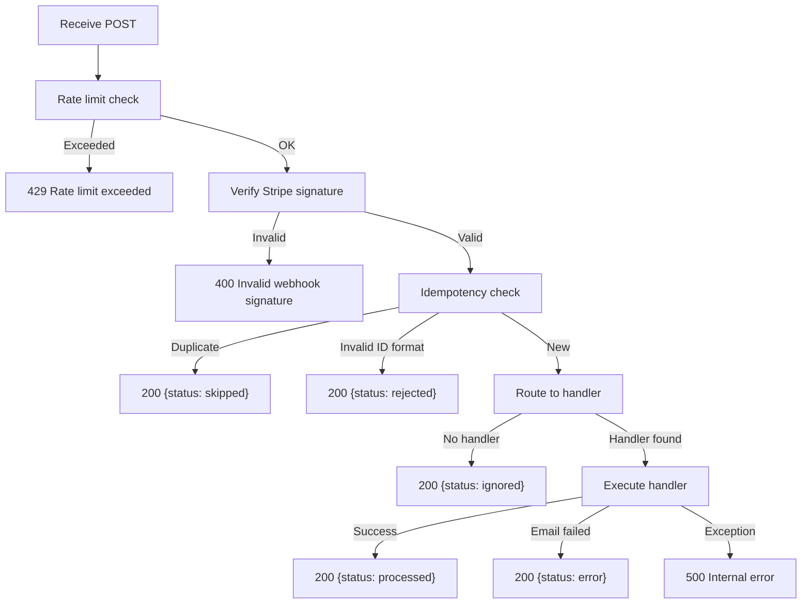

## Endpoints Overview

| Method | Path | Auth | Rate Limit | Description |
|--------|------|------|------------|-------------|
| `GET` | `/health` | None | None | Health check |
| `POST` | `/webhooks/stripe` | Stripe signature | `RATE_LIMIT_WEBHOOK` | Receive Stripe webhook events |
| `GET` | `/admin/audit-log` | `X-API-Key` header | `RATE_LIMIT_ADMIN` | Query audit log entries |

## `GET /health`

Returns the service health status.

**Request:** No parameters.

**Response:**

```json
{
  "status": "healthy",
  "service": "mail-gateway"
}
```

| Field | Type | Description |
|-------|------|-------------|
| `status` | `string` | Always `"healthy"` |
| `service` | `string` | Value of `APP_NAME` setting |

---

## `POST /webhooks/stripe`

Receives and processes Stripe webhook events. This is the primary ingress endpoint.

### Authentication

Stripe signs every webhook delivery with the `Stripe-Signature` header. The gateway verifies this signature using `STRIPE_WEBHOOK_SECRET` via the Stripe Python SDK. Invalid signatures return 400.

### Request

**Headers:**

| Header | Required | Description |
|--------|----------|-------------|
| `Stripe-Signature` | Yes | Stripe webhook signature |

**Body:** Raw Stripe event JSON (sent by Stripe).

### Processing Pipeline



### Idempotency

The endpoint uses atomic INSERT-based idempotency. Each Stripe event ID (`evt_*` format) is recorded in the `webhook_events` table with a unique constraint. Concurrent duplicate deliveries are safely handled via `IntegrityError` catch.

Event IDs that do not match the `evt_[A-Za-z0-9]+` pattern are rejected with `status: rejected`.

### Response

**Schema: `WebhookResponse`**

```json
{
  "status": "processed",
  "message": "Welcome email sent"
}
```

| Field | Type | Description |
|-------|------|-------------|
| `status` | `string` | One of: `processed`, `skipped`, `ignored`, `rejected`, `error` |
| `message` | `string` | Human-readable description |

**Status meanings:**

| Status | Meaning |
|--------|---------|
| `processed` | Event handled successfully; email sent |
| `skipped` | Duplicate event (already processed) |
| `ignored` | No handler registered for this event type, or event did not meet handling criteria |
| `rejected` | Event ID failed format validation |
| `error` | Handler executed but email delivery failed |

### Handled Event Types

| Stripe Event | Action |
|---|---|
| `customer.subscription.created` | Send welcome email (first subscription only) |
| `customer.subscription.deleted` | Send cancellation confirmation |
| `customer.subscription.updated` | Send plan change email (only when plan/items changed) |
| `invoice.payment_failed` | Send payment failure notification |
| `invoice.upcoming` | Send renewal reminder |

---

## `GET /admin/audit-log`

Query the webhook audit log with optional filters. Requires API key authentication.

### Authentication

Pass the admin API key in the `X-API-Key` header. The key must match the `ADMIN_API_KEY` environment variable.

| Scenario | Response |
|----------|----------|
| `ADMIN_API_KEY` not configured (empty) | `503 Admin endpoint not configured` |
| Key mismatch | `403 Invalid API key` |
| Key matches | Proceed |

### Query Parameters

| Parameter | Type | Default | Description |
|-----------|------|---------|-------------|
| `event_type` | `string` | `null` | Filter by Stripe event type (e.g. `customer.subscription.created`) |
| `customer_id` | `string` | `null` | Filter by Stripe customer ID |
| `date_from` | `datetime` (ISO 8601) | `null` | Start of date range |
| `date_to` | `datetime` (ISO 8601) | `null` | End of date range |
| `status` | `enum` | `null` | Filter by status: `processed`, `skipped`, or `failed` |
| `limit` | `int` | `50` | Max entries to return (1-200) |
| `offset` | `int` | `0` | Pagination offset (>= 0) |

### Response

**Schema: `AuditLogListResponse`**

```json
{
  "entries": [
    {
      "id": 1,
      "stripe_event_id": "evt_abc123",
      "event_type": "customer.subscription.created",
      "customer_id": "cus_xyz789",
      "payload": {"type": "customer.subscription.created", "email": "d***@example.com"},
      "status": "processed",
      "error_detail": null,
      "processing_ms": 245,
      "created_at": "2026-03-17T10:30:00+00:00"
    }
  ],
  "count": 1
}
```

**Entry fields (`AuditLogResponse`):**

| Field | Type | Description |
|-------|------|-------------|
| `id` | `int` | Auto-incrementing primary key |
| `stripe_event_id` | `string` | Stripe event ID |
| `event_type` | `string` | Stripe event type |
| `customer_id` | `string \| null` | Stripe customer ID (if applicable) |
| `payload` | `object \| null` | PII-redacted event payload |
| `status` | `string` | Processing status |
| `error_detail` | `string \| null` | Error description (on failure) |
| `processing_ms` | `int \| null` | Processing duration in milliseconds |
| `created_at` | `string \| null` | ISO 8601 timestamp |

---

## Rate Limiting

All rate-limited endpoints return `429 Too Many Requests` when the limit is exceeded:

```json
{
  "detail": "Rate limit exceeded. Please try again later."
}
```

The response includes a `Retry-After` header indicating seconds until the limit resets. No internal rate limit configuration details are exposed.

## Error Responses

| Status | Condition |
|--------|-----------|
| `400` | Invalid Stripe webhook signature |
| `403` | Invalid admin API key |
| `422` | FastAPI validation error (malformed query parameters) |
| `429` | Rate limit exceeded |
| `503` | Admin endpoint not configured (`ADMIN_API_KEY` empty) |
