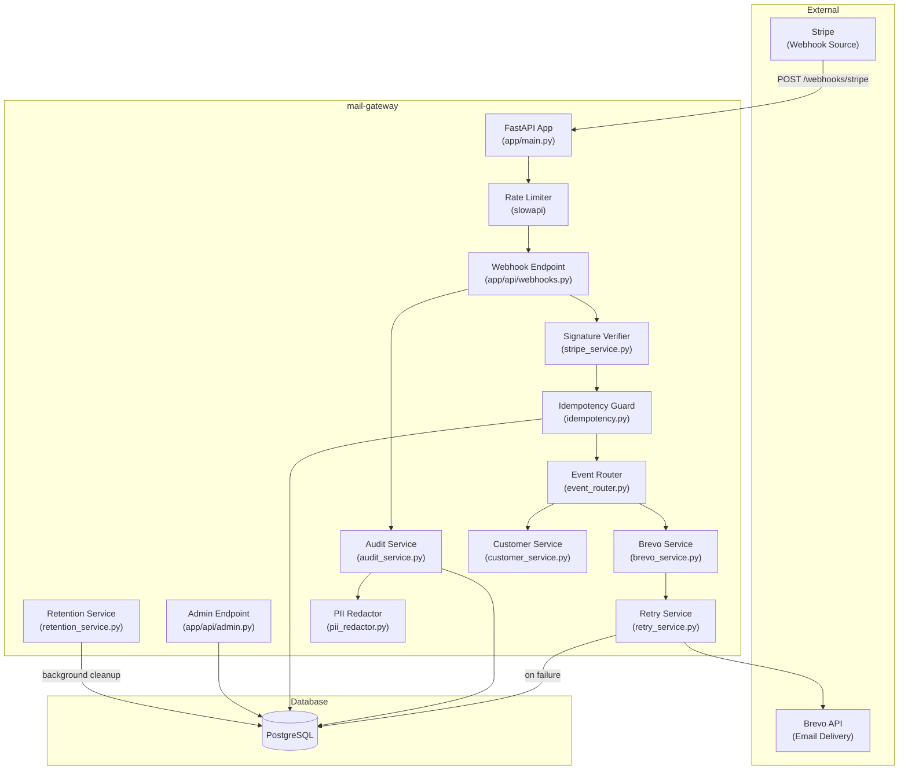
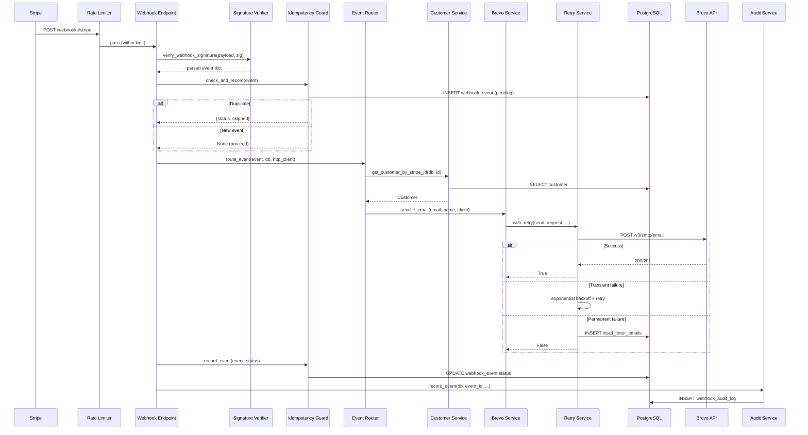

## Overview

mail-gateway is a FastAPI microservice that bridges Stripe payment events with transactional email delivery via the Brevo API. It receives Stripe webhooks, validates them cryptographically, routes events to type-specific handlers, and sends emails (welcome, cancellation, payment failure, renewal reminder, plan change) through Brevo with retry and dead-letter support.

## Why This Architecture

The system exists to automate customer communication in response to payment lifecycle events. Rather than coupling email logic into the billing system, the gateway acts as an independent bridge — receiving webhooks from Stripe on one side and dispatching emails through Brevo on the other. This separation allows the email logic to evolve independently and provides audit, retry, and GDPR compliance as cross-cutting concerns.

## Component Diagram



## Request Flow



## Layer Breakdown

### API Layer (`app/api/`)

| File | Purpose |
|------|---------|
| `webhooks.py` | `POST /webhooks/stripe` — receives Stripe webhooks, orchestrates verification, idempotency, routing, and audit |
| `admin.py` | `GET /admin/audit-log` — authenticated endpoint for querying audit logs with filters (event type, customer, date range, status) |

The webhook endpoint is the primary ingress point. The admin endpoint provides observability.

### Middleware Layer (`app/middleware/`)

| File | Purpose |
|------|---------|
| `rate_limiter.py` | IP-based rate limiting via slowapi; configurable per endpoint type (admin: 60/min, webhook: 100/min) |
| `idempotency.py` | Atomic INSERT-based duplicate detection using `webhook_events` table unique constraint on `stripe_event_id` |

The idempotency guard uses an INSERT-then-catch-IntegrityError pattern instead of SELECT-then-INSERT to eliminate race conditions from concurrent duplicate deliveries.

### Service Layer (`app/services/`)

| File | Purpose |
|------|---------|
| `stripe_service.py` | Webhook signature verification via `stripe.Webhook.construct_event`; customer data extraction; first-subscription detection |
| `event_router.py` | Registry-based dispatcher mapping Stripe event types to async handler functions |
| `brevo_service.py` | Email construction (inline HTML templates) and delivery via Brevo SMTP API |
| `customer_service.py` | Customer lookup by Stripe customer ID |
| `audit_service.py` | Audit log recording and querying with PII-redacted payloads |
| `retry_service.py` | Exponential backoff with jitter; transient/permanent error classification; dead-letter persistence |
| `retention_service.py` | Background TTL-based cleanup of `webhook_events` and `dead_letter_emails` tables in batches |

### Event Handler Registry

The event router uses a dictionary-based registry pattern:

| Stripe Event | Handler | Email Sent |
|---|---|---|
| `customer.subscription.created` | `_handle_subscription_created` | Welcome (first subscription only) |
| `customer.subscription.deleted` | `_handle_subscription_deleted` | Cancellation confirmation |
| `customer.subscription.updated` | `_handle_subscription_updated` | Plan change confirmation |
| `invoice.payment_failed` | `_handle_payment_failed` | Payment failure notification |
| `invoice.upcoming` | `_handle_invoice_upcoming` | Renewal reminder |

Unregistered event types return `{"status": "ignored"}` without error.

### Model Layer (`app/models/`)

| Model | Table | Purpose |
|-------|-------|---------|
| `Customer` | `customers` | Customer records with Stripe ID mapping |
| `WebhookEvent` | `webhook_events` | Idempotency tracking; stores processed event IDs and status |
| `AuditLog` | `webhook_audit_log` | Full event audit trail with PII-redacted payloads and processing metrics |
| `DeadLetter` | `dead_letter_emails` | Failed email deliveries awaiting manual review or re-processing |

### Utility Layer (`app/utils/`)

| File | Purpose |
|------|---------|
| `pii_redactor.py` | GDPR-compliant PII masking: email redaction, name redaction, payload scrubbing, salted SHA-256 correlation hashing |

## Data Model

```mermaid
erDiagram
    customers {
        int id PK
        string email
        string name
        string stripe_customer_id UK
        datetime created_at
        datetime updated_at
    }

    webhook_events {
        int id PK
        string stripe_event_id UK
        string event_type
        string status
        datetime processed_at
    }

    webhook_audit_log {
        int id PK
        string stripe_event_id IX
        string event_type IX
        string customer_id IX
        json payload
        string status
        text error_detail
        int processing_ms
        datetime created_at IX
    }

    dead_letter_emails {
        int id PK
        string recipient_email IX
        string template_id
        json payload
        text error_message
        int attempts
        datetime first_failed_at IX
        datetime last_failed_at
        string status IX
    }
```

## Background Processes

### Retention Cleanup

A background asyncio task (`retention_loop`) runs on a configurable interval (default: 24 hours) and deletes expired rows:

- `webhook_events`: rows older than `WEBHOOK_EVENTS_TTL_DAYS` (default: 30 days)
- `dead_letter_emails`: rows older than `DEAD_LETTER_TTL_DAYS` (default: 90 days)

Deletion is batch-based (`RETENTION_BATCH_SIZE`, default: 1000) to avoid long-running transactions. A minimum TTL of 1 day is enforced as a safety guard.

## Cross-Cutting Concerns

### PII Redaction

Enabled by default (`PII_REDACTION_ENABLED=True`). Applied at two points:
1. **Audit logging** — payloads are deep-copied and scrubbed before persistence via `redact_payload()`
2. **Log output** — email addresses are masked via `redact_email()` in all service-layer log statements
3. **Dead letter storage** — error messages are scrubbed of email patterns; payloads are redacted

A salted SHA-256 hash (`_pii_hash` key) is attached to redacted payloads for post-incident correlation.

### Retry and Dead Letter

The retry service classifies errors as transient (429, 5xx, timeouts, network) or permanent (4xx auth/validation). Transient failures are retried with exponential backoff and jitter (default: 3 retries, 1s base delay, 30s max). Permanent failures and exhausted retries write to the `dead_letter_emails` table.

### Rate Limiting

IP-based via slowapi. Two tiers:
- Webhook endpoints: `RATE_LIMIT_WEBHOOK` (default: 100/minute)
- Admin endpoints: `RATE_LIMIT_ADMIN` (default: 60/minute)

Rate limit exceeded responses return 429 with a `Retry-After` header and no internal details.
