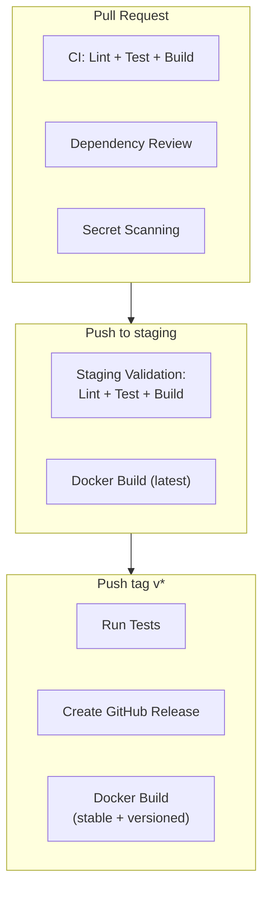

## CI/CD Pipeline Overview



## GitHub Actions Workflows

### CI (`ci.yml`)

**Triggers:** Pull requests to `main`, `develop`, `staging`; merge queue checks.

**Steps:**
1. Checkout code
2. Setup Python 3.12 with pip cache
3. Install dependencies from `requirements-dev.txt`
4. Lint with ruff (`ruff check .`)
5. Run tests (`pytest --tb=short -q`)
6. Verify syntax (`python3 -m py_compile app/main.py`)

**Concurrency:** One run per ref; in-progress runs are cancelled.

### Staging Validation (`staging-merge.yml`)

**Triggers:** Push to `staging` branch.

**Steps:** Same lint/test/build as CI, plus a conditional Docker build tagged as `latest` (only if a `Dockerfile` exists in the repo).

**Docker tag:** `ghcr.io/<repo>:latest`

### Release (`release.yml`)

**Triggers:** Push of a tag matching `v*`.

**Steps:**
1. Checkout with full history
2. Setup Python 3.12
3. Run tests
4. Create GitHub Release with auto-generated notes via `gh release create`
5. Conditional Docker build tagged as `stable` and `<tag>` (e.g. `v0.1.0`)

**Docker tags:** `ghcr.io/<repo>:stable`, `ghcr.io/<repo>:v0.1.0`

### Security (`security.yml`)

**Triggers:** Pull requests to `main`/`develop`; weekly schedule (Monday 06:00 UTC); manual dispatch.

**Jobs:**
- **Dependency Review** (PR only): Fails on high-severity vulnerabilities; denies GPL-3.0 and AGPL-3.0 licenses
- **Secret Scanning**: TruffleHog scan for verified secrets across git history
- **CodeQL** (commented out): Ready to enable for SAST analysis

### Issue Triage (`issue-triage.yml`)

**Triggers:** New issues opened.

Auto-labels issues based on keyword matching:
- Type: `task` or `idea`
- Priority: `priority:high`, `priority:medium`, `priority:low`
- Categories: `bug`, `security`, `documentation`
- Always adds `claude-code` and `status:todo` labels

### Status Guard (`status-guard.yml`)

**Triggers:** Label added to issues.

Enforces the status state machine: `status:todo` -> `status:in-progress` -> `status:to-test` -> `status:done`. Invalid transitions are reverted with an explanatory comment.

## Docker

The repository does not yet include a `Dockerfile`. The CI/CD workflows include conditional Docker build steps that activate once a `Dockerfile` is present.

**Recommended Dockerfile:**

```dockerfile
FROM python:3.12-slim

WORKDIR /app

COPY requirements.txt .
RUN pip install --no-cache-dir -r requirements.txt

COPY app/ ./app/

EXPOSE 8000

CMD ["uvicorn", "app.main:app", "--host", "0.0.0.0", "--port", "8000"]
```

**Docker tag strategy:**

| Branch/Event | Tag |
|---|---|
| Push to `staging` | `latest` |
| Push tag `v*` | `stable` + `v<version>` |

## Production Considerations

### Database

- Use a managed PostgreSQL instance (AWS RDS, Cloud SQL, etc.)
- Set `DATABASE_URL` with the `asyncpg` driver: `postgresql+asyncpg://...`
- Tables are auto-created on first startup; for production, consider Alembic migrations
- Indexes exist on: `stripe_event_id` (unique), `processed_at`, `created_at`, `event_type`, `customer_id`, `recipient_email`, `first_failed_at`, `status`

### Secrets Management

| Secret | Where to Configure |
|--------|-------------------|
| `STRIPE_WEBHOOK_SECRET` | Stripe Dashboard > Webhooks |
| `BREVO_API_KEY` | Brevo account settings |
| `ADMIN_API_KEY` | Generate a strong random key |
| `PII_HASH_SALT` | Generate a unique random string |
| `DATABASE_URL` | Infrastructure secret store |

Never commit secrets to the repository. Use platform-native secret management (GitHub Secrets, AWS Secrets Manager, Vault, etc.).

### Stripe Webhook URL

Configure the Stripe webhook endpoint to point to:
```
https://your-domain/webhooks/stripe
```

Subscribe to these events:
- `customer.subscription.created`
- `customer.subscription.deleted`
- `customer.subscription.updated`
- `invoice.payment_failed`
- `invoice.upcoming`

### Scaling

- The application is stateless (aside from the database). Scale horizontally by running multiple uvicorn workers or instances behind a load balancer.
- The shared `httpx.AsyncClient` is per-process (created in lifespan). Each instance manages its own connection pool.
- Rate limiting is per-instance (IP-based via slowapi). For distributed rate limiting, consider a Redis-backed limiter.
- The retention background task runs in each instance. With multiple instances, concurrent cleanup cycles are safe due to batch-based deletion with ID selection.

### Branch Strategy

| Branch | Purpose |
|--------|---------|
| `develop` | Active development |
| `staging` | Pre-production validation |
| `main` | Production releases |

Releases are tagged with `v` prefix (e.g., `v0.1.0`) from `main`. Version is tracked in `pyproject.toml`.
