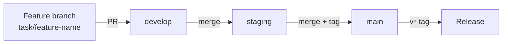

## Local Development Setup

### Prerequisites

- Python >= 3.11
- PostgreSQL >= 14
- A Stripe test account (for webhook secret)
- A Brevo test account (for API key)

### Quick Start

```bash
git clone https://github.com/dnviti/mail-gateway.git
cd mail-gateway
python3 -m venv .venv
source .venv/bin/activate
pip install -r requirements-dev.txt
cp .env.example .env
# Edit .env with your credentials
createdb mail_gateway
uvicorn app.main:app --reload --port 8000
```

### Dev Server

```bash
uvicorn app.main:app --reload --port 8000
```

The `--reload` flag enables auto-reload on file changes. The server listens on port 8000 by default.

## Project Structure

```
mail-gateway/
├── app/
│   ├── api/
│   │   ├── admin.py           # Admin audit-log endpoint
│   │   └── webhooks.py        # Stripe webhook endpoint
│   ├── db/
│   │   └── database.py        # SQLAlchemy async engine and session
│   ├── middleware/
│   │   ├── idempotency.py     # Duplicate event detection
│   │   └── rate_limiter.py    # IP-based rate limiting (slowapi)
│   ├── models/
│   │   ├── audit_log.py       # AuditLog SQLAlchemy model
│   │   ├── customer.py        # Customer model + DeclarativeBase
│   │   ├── dead_letter.py     # DeadLetter model
│   │   ├── schemas.py         # Pydantic request/response schemas
│   │   └── webhook_event.py   # WebhookEvent model
│   ├── services/
│   │   ├── audit_service.py   # Audit log recording and querying
│   │   ├── brevo_service.py   # Email construction and delivery
│   │   ├── customer_service.py # Customer DB lookups
│   │   ├── event_router.py    # Event type -> handler dispatch
│   │   ├── retention_service.py # Background TTL cleanup
│   │   ├── retry_service.py   # Exponential backoff + dead letter
│   │   └── stripe_service.py  # Signature verification, data extraction
│   ├── utils/
│   │   └── pii_redactor.py    # GDPR PII masking utilities
│   ├── config.py              # pydantic-settings configuration
│   ├── deps.py                # FastAPI dependency injection
│   └── main.py                # FastAPI app factory and lifespan
├── tests/
│   ├── conftest.py            # Shared fixtures (TestClient)
│   ├── test_pii_redactor.py   # PII redaction unit tests
│   └── test_webhooks.py       # Webhook endpoint tests
├── .github/workflows/         # CI/CD pipelines
├── .env.example               # Environment template
├── pyproject.toml             # Project metadata and dependencies
├── requirements.txt           # Production dependencies
└── requirements-dev.txt       # Dev dependencies (includes production)
```

## Testing

### Framework

pytest with pytest-asyncio for async test support.

### Running Tests

```bash
# Run all tests
pytest

# Run with short traceback
pytest --tb=short -q

# Run a specific test file
pytest tests/test_pii_redactor.py

# Run a specific test class
pytest tests/test_pii_redactor.py::TestRedactEmail

# Run a specific test
pytest tests/test_pii_redactor.py::TestRedactEmail::test_standard_email
```

### Test Structure

| File | Coverage | Description |
|------|----------|-------------|
| `tests/conftest.py` | Fixtures | Provides a `client` fixture (FastAPI `TestClient`) |
| `tests/test_webhooks.py` | `app/api/webhooks.py`, `app/main.py` | Health check, invalid signature, unhandled event type |
| `tests/test_pii_redactor.py` | `app/utils/pii_redactor.py` | Comprehensive PII redaction: email, name, error message, payload, hash |

### Test Conventions

- Test files: `test_*.py` pattern
- Test classes group related tests (e.g., `TestRedactEmail`, `TestRedactPayload`)
- External services are mocked with `unittest.mock.patch`
- The `TestClient` from FastAPI is used for endpoint tests (synchronous, no async DB)

## Linting

```bash
ruff check .
```

Ruff is configured as a dev dependency. The CI pipeline runs `ruff check .` on every PR.

## Branch Strategy



| Branch | Purpose | Merges to |
|--------|---------|-----------|
| `task/<name>` | Feature/task branches | `develop` |
| `develop` | Active development | `staging` |
| `staging` | Pre-production validation | `main` |
| `main` | Production | Tagged releases |

### Task Workflow

Tasks are developed in isolated git worktrees under `.worktrees/task/<code>/`. The task management system (CTDF) handles worktree creation, branch management, and status tracking via GitHub Issues.

Status flow: `status:todo` -> `status:in-progress` -> `status:to-test` -> `status:done`

## Adding a New Event Handler

To handle a new Stripe event type:

1. **Add the handler function** in `app/services/event_router.py`:

```python
async def _handle_new_event(
    event: dict, db: AsyncSession, *, http_client: httpx.AsyncClient | None = None
) -> dict:
    # Extract data, look up customer, send email
    ...
    return {"status": "processed", "message": "..."}
```

2. **Register the handler** at the bottom of `event_router.py`:

```python
register_handler("stripe.event.type", _handle_new_event)
```

3. **Add the email function** in `app/services/brevo_service.py` following the existing pattern (HTML template builder + `_send_email_with_retry` wrapper).

4. **Add tests** in `tests/`.

5. **Update Stripe webhook settings** to subscribe to the new event type.

## Adding a New Model

1. Create a new file in `app/models/` inheriting from `Base` (imported from `app/models/customer.py`).
2. Import the model in `app/db/database.py:init_db()` to ensure it is registered with SQLAlchemy's metadata.
3. Tables are auto-created on startup. For production schema changes, consider using Alembic.
