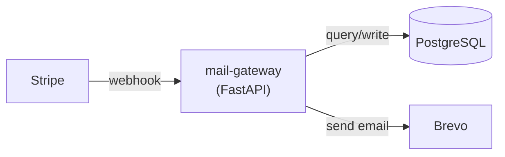

## mail-gateway

A FastAPI microservice that receives Stripe webhook events and sends transactional emails via the Brevo API. It handles subscription lifecycle events (welcome, cancellation, payment failure, renewal reminders, plan changes) with built-in idempotency, retry with dead-letter queue, GDPR-compliant PII redaction, audit logging, and automated data retention.

**Version:** 0.0.1
**Repository:** [github.com/dnviti/mail-gateway](https://github.com/dnviti/mail-gateway)

## Quick Start

```bash
git clone https://github.com/dnviti/mail-gateway.git
cd mail-gateway
python3 -m venv .venv && source .venv/bin/activate
pip install -r requirements.txt
cp .env.example .env   # Edit with your credentials
createdb mail_gateway
uvicorn app.main:app --reload --port 8000
curl http://localhost:8000/health
```

## Table of Contents

| Section | Description |
|---------|-------------|
| [Architecture](architecture.md) | System architecture, component diagrams, data flow, and design decisions |
| [Getting Started](getting-started.md) | Installation, prerequisites, and first run instructions |
| [Configuration](configuration.md) | Environment variables, `.env` template, and feature flags |
| [API Reference](api-reference.md) | HTTP endpoints, request/response schemas, authentication |
| [Deployment](deployment.md) | CI/CD pipelines, Docker, production setup, and scaling |
| [Development](development.md) | Contributing, local dev, testing, project structure |
| [Troubleshooting](troubleshooting.md) | Common errors, debugging, diagnostic flow, FAQ |
| [LLM Context](llm-context.md) | Consolidated single-file reference for LLM/bot consumption |

## Technology Stack

| Layer | Technology |
|-------|-----------|
| Web framework | FastAPI |
| ASGI server | Uvicorn |
| Database | PostgreSQL (async via SQLAlchemy + asyncpg) |
| HTTP client | httpx |
| Payment | Stripe Python SDK |
| Email | Brevo SMTP API |
| Configuration | pydantic-settings |
| Rate limiting | slowapi |
| Testing | pytest + pytest-asyncio |
| Linting | ruff |
| CI/CD | GitHub Actions |

## Architecture at a Glance



The gateway sits between Stripe and Brevo, providing verification, idempotency, routing, retry, audit, and PII compliance as cross-cutting concerns.
