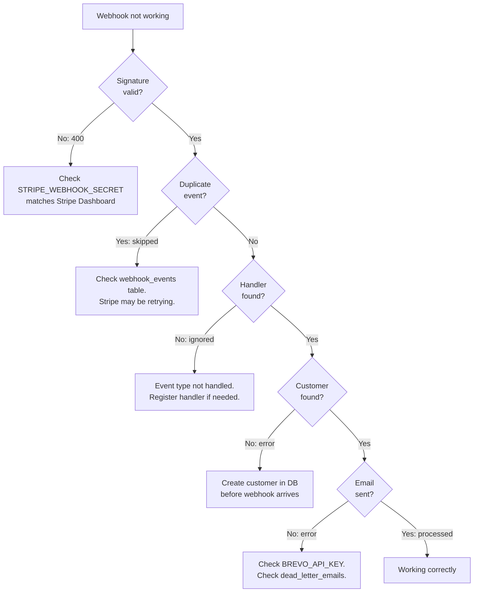

## Common Errors

### Startup

| Error | Cause | Fix |
|-------|-------|-----|
| `ValueError: Invalid rate limit format` | `RATE_LIMIT_ADMIN` or `RATE_LIMIT_WEBHOOK` has wrong format | Use format `<number>/<second\|minute\|hour\|day>` (e.g. `60/minute`) |
| `ValueError: Invalid sender email` | `SENDER_EMAIL` or derived email (`noreply@{APP_NAME}.com`) is invalid | Set a valid `SENDER_EMAIL` or ensure `APP_NAME` produces a valid domain |
| `ConnectionRefusedError` on startup | PostgreSQL is not running or `DATABASE_URL` is wrong | Verify PostgreSQL is running and the connection string uses `postgresql+asyncpg://` |
| `ModuleNotFoundError: asyncpg` | Missing database driver | Run `pip install asyncpg` or `pip install -r requirements.txt` |

### Webhook Processing

| Symptom | Cause | Fix |
|---------|-------|-----|
| `400 Invalid webhook signature` | Stripe signature verification failed | Verify `STRIPE_WEBHOOK_SECRET` matches the Stripe Dashboard value. Ensure the raw body is forwarded without modification. |
| `status: skipped` for every event | Idempotency guard detecting duplicates | Check the `webhook_events` table for existing entries. Stripe may be retrying events that were already processed. |
| `status: rejected` | Event ID does not match `evt_[A-Za-z0-9]+` pattern | This indicates a malformed or non-Stripe event. Verify the webhook source. |
| `status: ignored` | No handler registered for the event type | Only 5 event types are handled (see API Reference). Other types are intentionally ignored. |
| `status: error` + "Customer not found" | Customer's Stripe ID not in the `customers` table | Ensure customers are created in the database before webhooks arrive. |
| `status: error` + "Failed to send email" | Brevo API call failed after all retries | Check `BREVO_API_KEY` validity. Review `dead_letter_emails` table for details. |

### Admin Endpoint

| Symptom | Cause | Fix |
|---------|-------|-----|
| `503 Admin endpoint not configured` | `ADMIN_API_KEY` is empty | Set `ADMIN_API_KEY` in `.env` |
| `403 Invalid API key` | `X-API-Key` header does not match | Verify the header value matches `ADMIN_API_KEY` |

### Email Delivery

| Symptom | Cause | Fix |
|---------|-------|-----|
| `BREVO_API_KEY not configured` in logs | `BREVO_API_KEY` is empty | Set the key in `.env` |
| Emails stuck in dead letter | Permanent Brevo API failure (4xx) | Check `dead_letter_emails` table for `error_message`. Common: invalid API key (401), invalid recipient (400) |
| Emails retrying repeatedly | Transient Brevo API failure (429, 5xx) | Check Brevo service status. The retry service handles this automatically (3 retries with backoff). |

## Debugging

### Enable Debug Logging

Set `DEBUG=true` in `.env` to enable SQLAlchemy query echo. All services use Python's `logging` module at the `app.*` namespace.

### Inspect Database Tables

**Check processed events:**
```sql
SELECT stripe_event_id, event_type, status, processed_at
FROM webhook_events
ORDER BY processed_at DESC
LIMIT 20;
```

**Check audit log:**
```sql
SELECT stripe_event_id, event_type, status, error_detail, processing_ms, created_at
FROM webhook_audit_log
ORDER BY created_at DESC
LIMIT 20;
```

**Check dead letters:**
```sql
SELECT recipient_email, template_id, error_message, attempts, status, first_failed_at
FROM dead_letter_emails
WHERE status = 'pending'
ORDER BY first_failed_at DESC;
```

**Check customers:**
```sql
SELECT id, email, stripe_customer_id, created_at
FROM customers
WHERE stripe_customer_id = 'cus_...';
```

### Retention Cleanup

The background retention task logs its activity at `INFO` level:

```
Retention: background loop started (interval=24h, webhook_events TTL=30d, dead_letter TTL=90d)
Retention: starting cleanup cycle
Retention: deleted 150 webhook_events (batch), total so far: 150
Retention: finished webhook_events cleanup -- 150 rows deleted (TTL=30 days)
```

If retention is not running, check that the application started successfully (it is launched in the `lifespan` context manager).

## Diagnostic Flow



## FAQ

**Q: How do I test webhooks locally?**
Use the [Stripe CLI](https://stripe.com/docs/stripe-cli) to forward events to your local server:
```bash
stripe listen --forward-to localhost:8000/webhooks/stripe
```

**Q: How do I reprocess a dead letter email?**
Currently, dead letters must be reprocessed manually. Query the `dead_letter_emails` table for entries with `status = 'pending'`, then trigger the email send through the Brevo API or update the status.

**Q: Can I disable PII redaction for debugging?**
Set `PII_REDACTION_ENABLED=false` in `.env`. Only do this in development environments. When disabled, all redaction functions pass through values unchanged.

**Q: How do I add a new email template?**
Add a `_build_<template>_html()` function in `app/services/brevo_service.py`, then create a `send_<template>_email()` wrapper that calls `_send_email_with_retry()`. Register the corresponding Stripe event handler in `event_router.py`.

**Q: What happens when the database is down?**
The application will fail to start (table creation happens in `lifespan`). If the database goes down after startup, webhook processing will fail with database errors. The Stripe retry mechanism will re-deliver unacknowledged events.

**Q: How do I monitor the service?**
Use the `GET /health` endpoint for liveness checks. Query the admin audit log (`GET /admin/audit-log`) for processing metrics (status, processing_ms, error_detail). Monitor `dead_letter_emails` for delivery failures.
